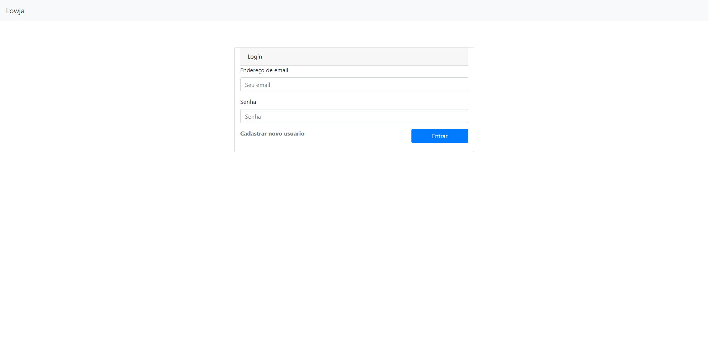
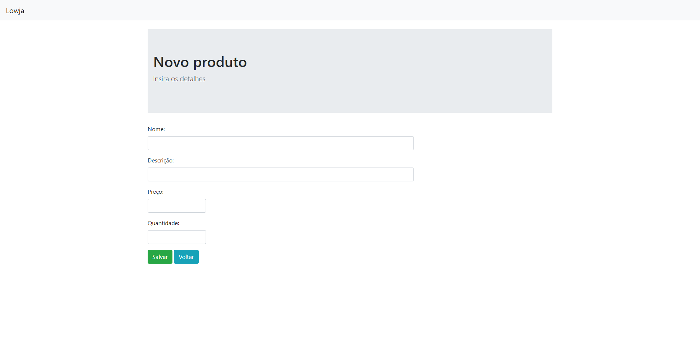
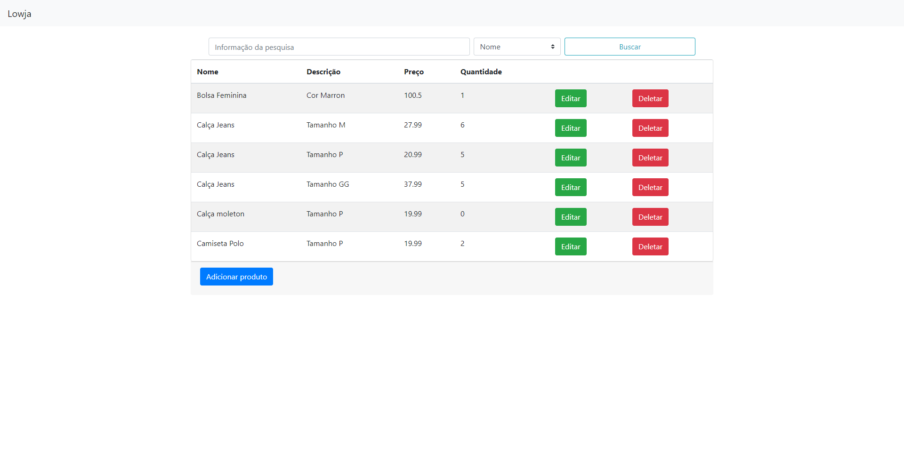
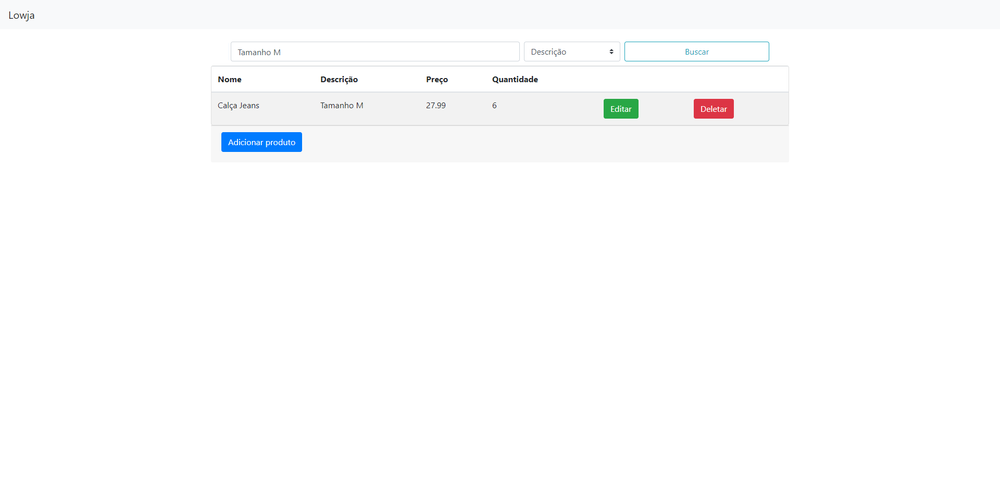

<h1 align="center">Lowja</h1>
<i>Status: Andamento</i>

## Descrição

Projeto desenvolvido para fins educacionais, afim de consolidar todo o conteudo absorvido durante os estudos com mini-cursos, blogs, publicações, documentações e livros.

## Sobre

Sistema simples com todas as funcionalidades de um CRUD basico.

### Instalação

```
Segue link para instalação do Go: http://www.golangbr.org/doc/instalacao
```

### Compilação

###### Developer

```
go run main.go
```

###### Banco de Dados

```
MySQL
```

###### api

```
Não foi usado
```

### Recursos

- [x] Lista produtos cadastrados
- [x] Pesquisar produtos cadastrados por nome ou descrição
- [x] Pagina de login
- [x] Cadastro de produto
- [x] Alteração de produto
- [x] Remoção de produto
- [ ] Cadastro de Usuario

### Tecnologias

- Golang
- Javascript
- HTML
- Css

### Projeto

<table>
<tr>
<td></td>
<td></td>  
<tr>
<td></td>
<td></td>  
<tr>
</table>

### Contribuição

- Felicio F. M. Neto
